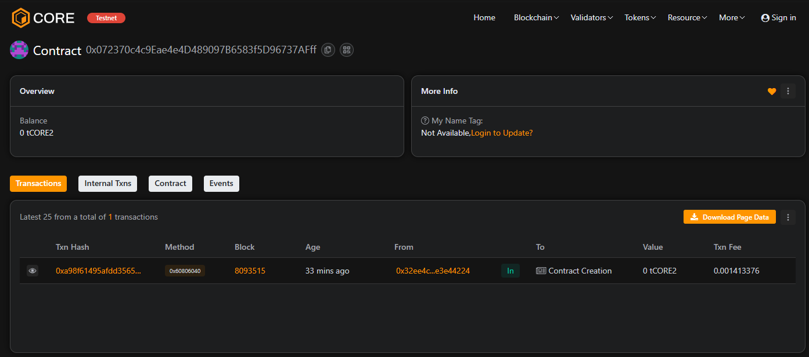

# LedgerFall

### Project Description
LedgerFall is a minimal on-chain ledger that lets each address store a single short record (note and amount) with an associated timestamp. It's designed for simple receipts, personal bookkeeping, or lightweight audit trails with minimal gas overhead.

### Project Vision
Provide a permissionless, easy-to-integrate primitive for recording small pieces of transactional metadata on-chain — useful for proofs of action, simple accounting, and composable dApp building blocks.

### Key Features
- addRecord(string note, uint256 amount) — store or update a single per-address ledger entry (note + amount + timestamp).
- getRecord(address owner) view — read any address's current record (note, amount, timestamp).
- deleteRecord() — remove the caller's stored record to free the slot.
- Single-slot-per-address design minimizes gas and surface area.
- Timestamped entries for off-chain correlation and auditing.

### Future Scope
- Multi-entry ledgers (append-only lists or indexed records) with pagination.
- Off-chain storage integration (IPFS/Arweave) for larger entries and reduced on-chain cost.
- Access controls, shared ledgers, and multisig-backed records for organizational use.
- Event-based indexing and subgraph support for efficient querying in frontends.
- Optional tokenized or auditable receipts (NFT receipts, verifiable claims).

### Contract address:
0x072370c4c9Eae4e4D489097B6583f5D96737AFff
